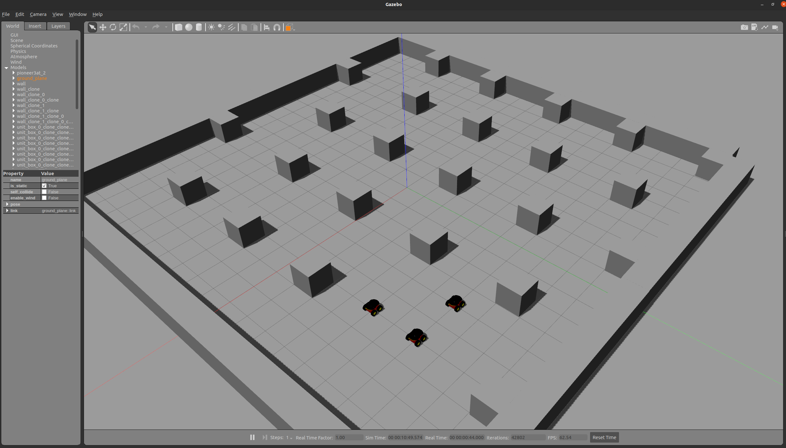

# [Table of Contents](#table-of-contents)

- [Table of Contents](#table-of-contents)
  - [Box World](#box-world)
  - [Forest](#forest)

## [Box World](#box-world)

I've configured the box world to run on low-spec computers, such as old laptops. Feel free to use it if you find it suitable. If you want to run this world, you must change the [run_simulation.sh](../src/scripts/run_simulation.sh) world parameters.

**World File:** [boxes.world](../gazebo_resources/worlds/boxes.world)

  

## [Forest](#forest)

Alternatively, I've designed the forest environment to include irregular obstacles. However, you will need a high-end computer to run it smoothly. By default, this world is launched by the [run_simulation.sh](../src/scripts/run_simulation.sh) script.

**World File:** [forest.world](../gazebo_resources/worlds/forest.world)

  
   
  
   
  

