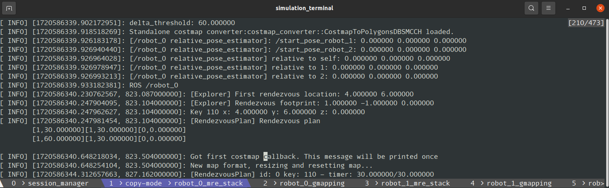
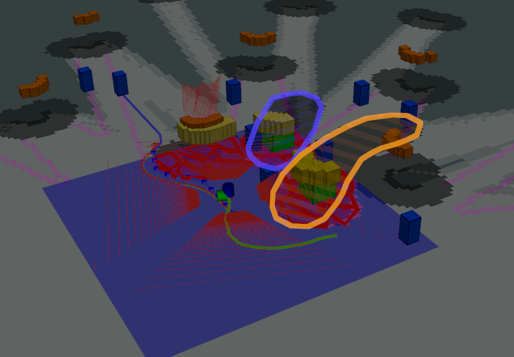

# [Table of Contents](#table-of-contents)

- [Table of Contents](#table-of-contents)
  - [Tmux and Session Manager](#tmux-and-session-manager)
  - [Traffic Avoidance](#traffic-avoidance)
  - [Subscriptions Through Lambda](#subscriptions-through-lambda)

## [Tmux and Session Manager](#tmux-and-session-manager)

Many students and professionals I've encountered do not rely on tools such as ```tmux``` for visualization and organizational purposes when working with ROS. Consequently, they end up running complex systems with numerous messages, warnings, and errors in their terminal, which degrades debugging and visualization quality. In the multi-robot case, which is considerably more complicated, the situations is even worse. Consequently, I highly encourage the use of ```tmux``` to manage ROS-based multi-robot systems. 

For example, the following terminal session,

<p align="center">
  
</p>

can be created by simply calling ```tmux``` with the ```new-session``` command.

  ```bash
  tmux new-session -n session_manager -s simulation -d "roslaunch multirobotsimulations gazebo_multi_robot_bringup.launch world_name:=forest.world paused:=true"
  ```

Breaking this command down, the ```-n``` flag specifies the window name, which is ```session_manager```, the ```-s``` command specifies the session ID, which is ```simulation```, and the ```-d``` command specifies the command line that will be run, which is just a ros command ```roslaunch multirobotsimulations gazebo_multi_robot_bringup.launch world_name:=forest.world paused:=true```.

To launch the created session in a terminal, just open a terminal manager, such as GNOME Terminal, and tell tmux to attach to the created session ID.

  ```bash
  gnome-terminal -t simulation_terminal --geometry=150x20 --hide-menubar -- tmux attach-session -t simulation
  ```

You can run as many windows as you need for any number of components, attach them to the same session ID, and keep things clean. See the [launch_robots.sh](../src/scripts/launch_robots.sh) scripts for more examples.

## [Traffic Avoidance](#traffic-avoidance)

A huge problem in multi-robot systems is traffic management. There are a lot of solutions to cope with this, such as using [level sets](https://en.wikipedia.org/wiki/Level_set) when optimizing trajectories. In this project
I'm using a simple mechanism, where robots share their controls ```n``` time steps in the future to all robots they can communicate with when enhance their global and local configuration spaces for planning. The system is fully distributed, however, robots can act as fully rational agents without sharing their controls by replacing this mechanism with anything that predicts others' trajectories.

In the RViz window, the controls of other robots should appear as ```polygon``` obstacles. The following image highlights them as orange and blue striped blobs.

<p align="center">
  
</p>

## [Subscriptions Through Lambda](#sumbscriptions-through-lambda)

When I started working with multiple robots, I encountered a problem that many students also face: the lack of a robust mechanism to create dynamic subscriptions given a variable number of robots. Fortunately, C++11 provides a mechanism for declaring lambda functions, which can help address this issue. In this workspace, you will find some nodes where I have declared subscriptions to other robots' nodes using lambda functions. This approach allows for a variable number of callbacks without explicitly declaring the functions in an object's body.

Below is an example of how to dynamically subscribe to a variable number of robots' ```/robot_<id>/fusion``` topics, which receive maps from each of them, from the [MapStitchingNode.cpp](../src/multirobotexploration/source/map/MapStitchingNode.cpp).

  ```c++
  for(int robot = 0; robot < aRobots; ++robot) {
      if(robot == aId) continue;

      nav_msgs::OccupancyGrid* occPtr = &aRobotsOcc[robot];
      std_msgs::Int8MultiArray* commPtr = &aRobotsInCommMsg;
      std::vector<bool>* receivedFlagPtr = &aReceivedOccs;
      aSubscribers.push_back(
          node_handle.subscribe<nav_msgs::OccupancyGrid>(
                  "/robot_" + std::to_string(robot) + "/fusion", 
                  aQueueSize, 
                  [occPtr, receivedFlagPtr, commPtr, robot](nav_msgs::OccupancyGrid::ConstPtr msg){
                      // mock communication to merge maps
                      // if this flag is 0, then the 'robot' cannot
                      // share its map
                      if(commPtr->data[robot] == 0) return;

                      // otherwise, update the last received map
                      occPtr->data.assign(msg->data.begin(), msg->data.end());
                      occPtr->info = msg->info;
                      occPtr->header = msg->header;

                      // set received flag to true
                      receivedFlagPtr->at(robot) = true;
                  }));
  }
  ```
