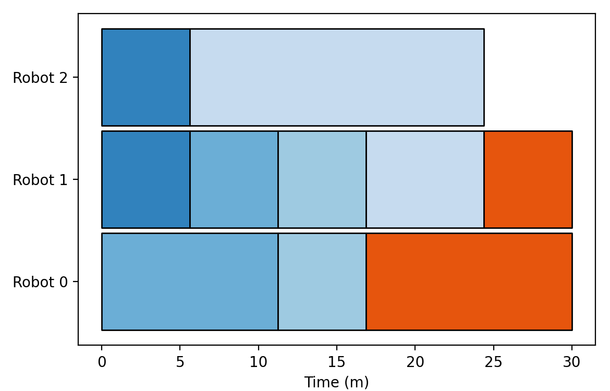

# 🚀 Usage Guide

**Complete guide to running multi-robot exploration simulations**

---

## 📋 Table of Contents

- [📋 Table of Contents](#-table-of-contents)
- [⚙️ Prerequisites](#️-prerequisites)
- [🎯 Generate Rendezvous Plan](#-generate-rendezvous-plan)
- [🏁 Start Simulation](#-start-simulation)
- [🔧 Select Policy](#-select-policy)
- [📊 Analysis & Results](#-analysis--results)

---

## ⚙️ Prerequisites

Before running the simulation, ensure you have:

- ✅ Ubuntu 20.04 LTS
- ✅ ROS 1 Noetic (properly installed and sourced)
- ✅ All dependencies from [working environment guide](working_environment.md)
- ✅ `tmux` installed: `sudo apt install tmux`

> 📝 **Note**: Make sure to source your workspace: `source devel/setup.bash`

---

## 🎯 Generate Rendezvous Plan

### Step 1: Run the Plan Generator

Execute the rendezvous plan generator from the repository root:

```bash
python3 ./rendezvous_plan_generator/RendezvousMILP.py 3 5 30 2 5 1.0 10.0
```

### Parameters Explanation

| Parameter | Description | Example Value |
|-----------|-------------|---------------|
| `robots` | Number of robots | `3` |
| `rendezvous_events` | Total time steps | `5` |
| `duration` | Mission duration (minutes) | `30` |
| `robots_per_plan` | Minimum gap between meetings | `2` |
| `minimum_job_size` | Maximum gap between meetings | `5` |
| `alpha` | Communication weight | `1.0` |
| `beta` | Exploration weight | `10.0` |

### Generated Output

The generator creates a rendezvous plan and saves it to the configuration folder:

<div align="center">
  
  <p><em>Example rendezvous plan visualization</em></p>
</div>

> 🔬 **Research**: Plan details and methodology are explained in our [published papers](../README.md#-publications)

---

## 🏁 Start Simulation

### Step 1: Launch Simulation Environment

```bash
./src/scripts/demo.sh
```

This will:
- 🎮 Open Gazebo simulator
- 📊 Launch RViz visualization
- ⚙️ Initialize base simulation environment

### Step 2: Spawn Robot Stack

Once Gazebo and RViz are loaded:

```bash
./src/scripts/spawn_robot.sh
```

This will:
- 🤖 Deploy all robot nodes
- 🗺️ Initialize mapping components
- 📡 Start communication systems

### Step 3: Start Exploration Mission

Wait until you see the occupancy grid in RViz, then:

```bash
./src/scripts/start_exploration.sh Silva2025
```

### Available Methods

| Method | Description |
|--------|-------------|
| `Silva2025` | Latest MILP-based approach with Rendezvous Tracking for Unknown Scenarios (RTUS) (ICAR 2025) |
| `Silva2024` | Communication-constrained method (IROS 2024) |
| `priority_allocation` | Priority-based allocation |
| `randomized_social_welfare` | Social welfare optimization |
| `yamauchi_1999` | Classical frontier-based approach |

---

## 🔧 Select Policy

### Method 1: Command Line (Recommended)

Pass the method as a parameter when starting exploration:

```bash
./src/scripts/start_exploration.sh <METHOD_NAME>
```

### Method 2: Script Configuration

Edit the `method` variable in [`spawn_robot.sh`](../src/scripts/spawn_robot.sh):

```bash
# Available options:
method="Silva2025"           # Default - Latest MILP approach
# method="Silva2024"         # IROS 2024 method
# method="priority_allocation"
# method="randomized_social_welfare"  
# method="yamauchi_1999"
```

---

## 📊 Analysis & Results

### Automatic Data Collection

The simulation automatically saves a ROS bag file containing:

- 📡 **Communication logs** - Rendezvous events and data exchange
- ⏱️ **Performance metrics** - Waiting times at rendezvous locations
- 📊 **Coverage statistics** - Total and average area explored

### Bag File Location

```bash
# Default location
./bags/<timestamp>.bag
```

---

## ⚡ Quick Reference

### Essential Commands

```bash
# Complete simulation workflow
python3 ./rendezvous_plan_generator/RendezvousMILP.py 3 5 30 2 5 1.0 10.0
./src/scripts/demo.sh
./src/scripts/spawn_robot.sh  
./src/scripts/start_exploration.sh Silva2025
```

### Troubleshooting

| Issue | Solution |
|-------|----------|
| Gazebo won't start | Check ROS environment: `echo $ROS_PACKAGE_PATH` |
| No occupancy grid | Wait longer, ensure gmapping is running |
| Robot spawn fails | Verify all dependencies are built: `catkin build` |
| Script permissions | Make executable: `chmod +x src/scripts/*.sh` |

---

## 📚 Next Steps

- 📖 [Explore robot configurations](robots.md)
- 🗺️ [Learn about available maps](maps.md)
- 🔬 [Read our research papers](../README.md#-publications)
- 🤝 [Contribute to the project](contributing.md)

---

<div align="center">
  <sub>Need help? <a href="https://github.com/multirobotplayground/ROS-Noetic-Multi-robot-Sandbox/issues">Submit an issue</a> 🐛</sub>
</div>