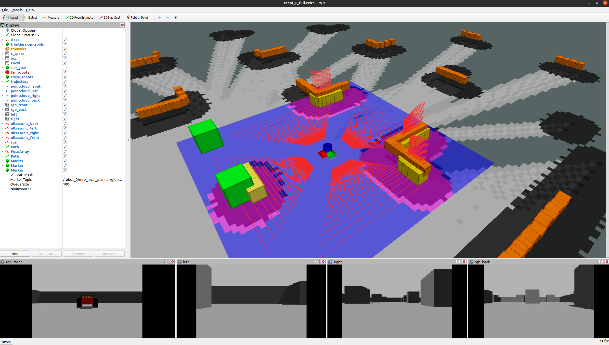

# [Table of Contents](#table-of-contents)

- [Table of Contents](#table-of-contents)
  - [Usage](#usage)
  - [Rendezvous Plan and Footprint](#rendezvous-plan-and-footprint)
  - [Main Launch Files](#main-launch-files)
  - [Robot Spawn and support launch files](#robot-spawn-and-support-launch-files)
  - [Rviz Configuration Files](#rviz-configuration-files)
  - [Communicating with the Robots](#communicating-with-the-robots)
  - [Stack Overview](#stack-overview)

## [Usage](#usage)

Before running the simulation, make sure you followed the steps I've described in the [working environment](working_environment.md) and that Ubuntu 20.04 and ROS 1 Noetic are properly installed and follow these steps.

1. Open a terminal.
2. Enter the ```ROS-Noetic-Multi-robot-Sandbox``` folder in the terminal you have oppened.
3. Source the project.

    ```bash
    source devel/setup.bash
    ```

4. Run the simulation script.

    ```bash
    ./src/scripts/run_simulation.sh
    ```

If everything worked correctly, gazebo and rviz will be opened and you should see the following scene:

<p align="center">
  
</p>

1. Run the intermittent communication multi-robot exploration stack.

    ```bash
    ./src/scripts/launch_robots.sh
    ```

If everything worked correctly, you should see the following in the rviz window for the robot with ```id = 0```,

<p align="center">
  
</p>

and the following rviz windows, one for each robot, that shows their local maps with their trajectories.

<p align="center">
  
</p>

Furthermore, the stack is launched in independend ```tmux``` windows as follows.

<p align="center">
  
</p>

It turns out that when working with multiple robots or ```ROS``` with stacks from any nature, ```tmux``` in a setup like this is a **must**.

1. To start the exploration, run the startup script. It will send a message to all robots' controllers so they known when to start doing things.

    ```bash
    ./src/scripts/start_exploration.sh
    ```

When robots start doing their stuff, you should see some updates in all rviz window the robot with ```id = 0``` as follows.

<p align="center">
  
</p>

The trajectories should looks like the following after some time.

<p align="center">
  
</p>

I use a stop script to shutdown everything ```src/scripts/stop_forced.sh```, because ```ROS``` takes to long to bring everything down. It is not the best practice, however it can save your time.

## [Rendezvous Plan and Footprint](#data-structures)

The major data structure from this package is called ```rendezvous plan```. It is composed by agreements that allow robots to decide where, with whom, and when to rendezvous. I encourage you to read our [paper](https://arxiv.org/abs/2309.13494) to better understand it.

<p align="center">
  
</p>

This structure is loaded by robots in this stack through the ```rendezvous_plan.yaml``` configuration file and it looks like the following.

```yaml
width: 3

K: [1,1,0,
    0,1,1,
    1,1,0,
    0,1,1]

W: [30, 30, 0 ,
    0 , 30, 60,
    60, 30, 0 ,
    0 , 30, 60 ]

first_rendezvous: {x: 4.0, y: 6.0, z: 0.0}
```

**The K matrix can be represented by W alone. I call K as a binarized form of the plan represented by W and it can be useful in some evolutionary algorithms, which we suggest using to generate the plan. Furthermore, with a separate W matrix, more complex behaviors can be achieved, such as making specific robots act as beacons at specific rendezvous events.**

To avoid traffic at rendezvous location, which is a major issue, I've had to make robots use the concept of a ```rendezvous footprint```, which tells them their position at the assigned zone. The rendezvous footprints are loaded through the ```rendezvous_footprint.yaml``` configuration file. It looks like the following.

```yaml
footprint_robot_0: {x:  1, y: -1, z: 0, theta: 0}
footprint_robot_1: {x: -1, y: -1, z: 0, theta: 0}
footprint_robot_2: {x: -1, y:  1, z: 0, theta: 0}
```

Nevertheless, known starting poses are passed through the ```gazebo_robots_start_pose.yaml``` configuration file.

## [Main Launch Files](#main-launch-files)

- [gazebo_multi_robot_bringup.launch](../src/multirobotsimulations/launch/gazebo_multi_robot_bringup.launch)
- [exploration_stack_bringup](../src/multirobotexploration/launch/exploration_stack_bringup.launch)

## [Robot Spawn and support launch files](#robot-spawn-and-support-launch-files)

- [gmapping](../src/multirobotexploration/launch/gmapping.launch)
- [gazebo_add_robot.launch](../src/multirobotsimulations/launch/gazebo_add_robot.launch)

## [Rviz Configuration Files](#rviz-configuration-files)

There is one configuration file for each robot I've configured in the main launch file and a ```special``` configuration for the robot with ```id = 0```. They are located at ```src/multirobotexploration/rviz``` folder.

They are being run automatically, however, if you want to run them by hand for any reason, do the following.

1. Ensure that the simulation is running as [described](#usage).
2. Open a new terminal or use ```tmux```.
3. Open rviz with the following command in your new tmux partition.

    ```bash
    rviz
    ```

4. Go to the top menu of rviz and load one of the configuration files provided.

**The system is fully decentralized and each robot has its own view of the environment !!!**

## [Communicating with the Robots](#communicating-with-the-robots)

To see the topics available to communicate with the robots through ROS, do the following.

1. Ensure that the simulation is running as [described](#usage).
2. Open a new terminal or use ```tmux```.
3. Run the following command on your new tmux partition.

    ```bash
    rostopic list
    ```

4. If everything was done correctly, you should see the following topics for each robot namespace in your terminal

    ```bash
    /robot_0/average_velocity
    /robot_0/c_space
    /robot_0/c_space_local
    /robot_0/c_space_local_updates
    /robot_0/c_space_updates
    /robot_0/camera/camera_info
    /robot_0/camera/depth/camera_info
    /robot_0/camera/image_raw
    /robot_0/camera/image_raw/compressed
    /robot_0/camera/image_raw/compressed/parameter_descriptions
    /robot_0/camera/image_raw/compressed/parameter_updates
    /robot_0/camera/image_raw/compressedDepth
    /robot_0/camera/image_raw/compressedDepth/parameter_descriptions
    /robot_0/camera/image_raw/compressedDepth/parameter_updates
    /robot_0/camera/image_raw/theora
    /robot_0/camera/image_raw/theora/parameter_descriptions
    /robot_0/camera/image_raw/theora/parameter_updates
    /robot_0/camera/image_raw_depth
    /robot_0/camera/parameter_descriptions
    /robot_0/camera/parameter_updates
    /robot_0/camera/points
    /robot_0/camera_back/camera_info
    /robot_0/camera_back/depth/camera_info
    /robot_0/camera_back/image_raw
    /robot_0/camera_back/image_raw/compressed
    /robot_0/camera_back/image_raw/compressed/parameter_descriptions
    /robot_0/camera_back/image_raw/compressed/parameter_updates
    /robot_0/camera_back/image_raw/compressedDepth
    /robot_0/camera_back/image_raw/compressedDepth/parameter_descriptions
    /robot_0/camera_back/image_raw/compressedDepth/parameter_updates
    /robot_0/camera_back/image_raw/theora
    /robot_0/camera_back/image_raw/theora/parameter_descriptions
    /robot_0/camera_back/image_raw/theora/parameter_updates
    /robot_0/camera_back/image_raw_depth
    /robot_0/camera_back/parameter_descriptions
    /robot_0/camera_back/parameter_updates
    /robot_0/camera_back/points
    /robot_0/camera_left/camera_info
    /robot_0/camera_left/depth/camera_info
    /robot_0/camera_left/image_raw
    /robot_0/camera_left/image_raw/compressed
    /robot_0/camera_left/image_raw/compressed/parameter_descriptions
    /robot_0/camera_left/image_raw/compressed/parameter_updates
    /robot_0/camera_left/image_raw/compressedDepth
    /robot_0/camera_left/image_raw/compressedDepth/parameter_descriptions
    /robot_0/camera_left/image_raw/compressedDepth/parameter_updates
    /robot_0/camera_left/image_raw/theora
    /robot_0/camera_left/image_raw/theora/parameter_descriptions
    /robot_0/camera_left/image_raw/theora/parameter_updates
    /robot_0/camera_left/image_raw_depth
    /robot_0/camera_left/parameter_descriptions
    /robot_0/camera_left/parameter_updates
    /robot_0/camera_left/points
    /robot_0/camera_right/camera_info
    /robot_0/camera_right/depth/camera_info
    /robot_0/camera_right/image_raw
    /robot_0/camera_right/image_raw/compressed
    /robot_0/camera_right/image_raw/compressed/parameter_descriptions
    /robot_0/camera_right/image_raw/compressed/parameter_updates
    /robot_0/camera_right/image_raw/compressedDepth
    /robot_0/camera_right/image_raw/compressedDepth/parameter_descriptions
    /robot_0/camera_right/image_raw/compressedDepth/parameter_updates
    /robot_0/camera_right/image_raw/theora
    /robot_0/camera_right/image_raw/theora/parameter_descriptions
    /robot_0/camera_right/image_raw/theora/parameter_updates
    /robot_0/camera_right/image_raw_depth
    /robot_0/camera_right/parameter_descriptions
    /robot_0/camera_right/parameter_updates
    /robot_0/camera_right/points
    /robot_0/cmd_vel
    /robot_0/costmap_converter/obstacles
    /robot_0/explorer/set_exploring
    /robot_0/explorer/set_idle
    /robot_0/frontier_discovery/compute
    /robot_0/frontier_discovery/frontiers
    /robot_0/frontier_discovery/frontiers_clusters
    /robot_0/frontier_discovery/frontiers_clusters_markers
    /robot_0/frontier_discovery/frontiers_clusters_markers_array
    /robot_0/frontier_discovery/frontiers_updates
    /robot_0/fusion
    /robot_0/fusion_updates
    /robot_0/gmapping_pose/pose_stamped
    /robot_0/gmapping_pose/world_pose
    /robot_0/imu
    /robot_0/integrated_global_planner/current_path
    /robot_0/integrated_global_planner/finish
    /robot_0/integrated_global_planner/goal
    /robot_0/integrated_global_planner/path
    /robot_0/integrated_global_planner/stop
    /robot_0/joint_states
    /robot_0/laser_to_world/laser_occ
    /robot_0/laser_to_world/laser_world
    /robot_0/laser_to_world/lidar_occ_0
    /robot_0/laser_to_world/lidar_occ_1
    /robot_0/laser_to_world/lidar_occ_2
    /robot_0/laser_to_world/lidar_occ_3
    /robot_0/laser_to_world/lidar_world_0
    /robot_0/laser_to_world/lidar_world_1
    /robot_0/laser_to_world/lidar_world_2
    /robot_0/laser_to_world/lidar_world_3
    /robot_0/local_free_poses
    /robot_0/local_occupied_poses
    /robot_0/local_planner/global_plan
    /robot_0/local_planner/global_via_points
    /robot_0/local_planner/global_via_points_array
    /robot_0/local_planner/local_plan
    /robot_0/local_planner/optimal_poses
    /robot_0/local_planner/teb_feedback
    /robot_0/local_planner/teb_markers
    /robot_0/local_planner/teb_markers_array
    /robot_0/local_planner/teb_poses
    /robot_0/map
    /robot_0/map_metadata
    /robot_0/mock_communication_model/robots_in_comm
    /robot_0/node_costmapconverter/parameter_descriptions
    /robot_0/node_costmapconverter/parameter_updates
    /robot_0/node_slam_gmapping/entropy
    /robot_0/odom
    /robot_0/path
    /robot_0/plan_updater
    /robot_0/polygon_marker
    /robot_0/realizing_plan
    /robot_0/relative_pose_estimator/distances
    /robot_0/relative_pose_estimator/pose_far_markers
    /robot_0/relative_pose_estimator/pose_far_markers_array
    /robot_0/relative_pose_estimator/pose_markers
    /robot_0/relative_pose_estimator/pose_markers_array
    /robot_0/relative_pose_estimator/relative_poses
    /robot_0/relative_pose_estimator/relative_start
    /robot_0/scan
    /robot_0/ultrasonic
    /robot_0/ultrasonic_front
    /robot_0/ultrasonic_left
    /robot_0/ultrasonic_right
    ```

Since robots are properly configured with their namespace, you should be able to control and visualize them apropriately if needed with ros commands such as ```rostopic pub```, ```rostopic info```, and ```rostopic echo```.

## [Stack Overview](#stack-overview)

This stack implements the following components highlighted in red.

<p align="center">
  
</p>

To see how they look in the real system, do the following.

1. Ensure that the simulation is running as [described](#usage).
2. Open a new terminal or use ```tmux```.
3. Run the following command on your new tmux window.

    ```bash
    rosrun rqt_graph rqt_graph
    ```

If everything was done correctly, you should see the following system for all robots.

<p align="center">
  
</p>

**The stack is not perfect, but it serves for its purpose. I encourage you to explore the scene and have some fun! :)**


